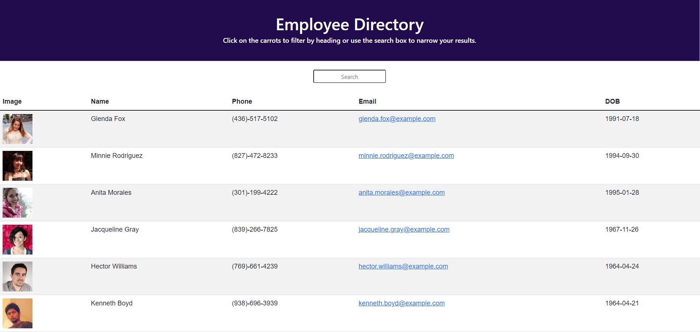

# Employee-Directory

## Description
This app is an employee directory that generates 25 random employees when accessed. It allows the user the ability to search for specific users based on their employee data. 

## Link to Page
https://brandon-maxwell.github.io/Employee-Directory/

## Preview of Application:

## Table of Contents
* [Intallation](#installation)
* [Usage](#usage)
* [License](#license)
* [Contributing](#contributing)
* [Questions](#questions)

## Installation
To install necessary dependencies, run the following command:
~~~
npm i
~~~

## Usage
To run this application the user simply opens the page to see the employee directory. The user can also type in the search bar to update the table with results matching the search.

## License 
This project is licensed under the [The Unlicense](http://unlicense.org/) license.

## Contributing
When contributing to this repository, Fork the repo on GitHub, Clone the project to your machine, Commit changes to your own branch, Push your work back up to your fork, then Submit a pull request so your changes can be reviewed.

## Questions
If you have any questions about the repo, open an issue or contact me directly at brandon.l.maxwell@gmail.com. You can find more of my work at [brandon-maxwell](https://github.com/brandon-maxwell).